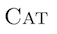

# UMass Med GSBS PhD Thesis template

This is a template and compilation pipeline designed to make writing your thesis just a bit less terrible and perhaps even a bit enjoyable.

This template uses a number of well-tested, open-source tools to take a series of simple text files, your figure image files, and your provided metadata and stitch them together into a great looking pdf file that is ready for printing.

## Getting started

### Prerequisites

There are a few pieces of software that you need in order for the UMMSThesis template to work properly:

- **Required:**
	- a TeX distribution (MacTeX, TeXLive, or MikTeX, etc.)
	- pandoc
	- pandoc-citeproc
	- python
	- the files included here (availble as a `.zip` via the "Clone or Download" button above, or from this link: https://github.com/GSBS-Bootstrappers/umassmed-tex/archive/master.zip)

- **Optional:**
	- highlighting-kate 
		- (used to provide syntax highlighting for blocks of source code)
	- computer modern unicode font 
		- available at: http://cm-unicode.sourceforge.net/install.html
		- a classic, smart-looking font that supports pretty much all greek/scientific symbol

The layout of this demonstration directory is as follows:

```
├── metadata.yaml (author, title, readers, date, chapter file names, etc.)
├── acknowledgements.md
├── dedication.md
├── abstract.md
├── chapter-project-one.md
├── project-two.md
├── introduction.md
├── ...
├── ...
└── figures/
|   ├── western-blot.pdf
|   ├── qpcr.pdf
|   └── gene-pile-up.pdf
└── bin/
    ├── ummsthesis.lua                   (custom writer for pandoc)
    ├── ummsthesis-template.latex        (custom template for pandoc)
    ├── nih-citation-styles.csl          (citation styles format....not decided on this yet)
    └── compile                          (python script that pulls everything together and 
                                          sends it to pandoc, and then saves the pdf properly)
```                                          
### Brief Summary 

Together, everything is a collection of all of the disparate elements of a thesis, neatly organized into separate documents and folders. At any time you are free to them compile these elements using the included software to generate a single PDF file of your thesis. A few benefits of this approach: you can edit a figure image file, without then having to copy and paste into your thesis after every change, your table of contents is automatically generated based on the current layout of your sections, your writing application doesn't become slow and laggy because your thesis contains a lot of images and text elements. 

### How it works

There is a markdown file (a file ending in ".md") for each chapter in your thesis. These files are plain text files (you can open and edit them in textedit, or notepad for example). More about markdown is described just below. 

Each figures also exists as the simple image file within this folder. Formats that work include ".pdf", ".eps", ".jpg". (*nb - support for `.tiff` files is forthcoming*). These files can be all together in a figures folder, or you can put them elsewhere. When you put a figure into your thesis, you simply type the location of the image file along with the caption text into a chapterX.md file. In this way you are free to update or edit the figure files themselves at any time, and your figures will be updated automatically the next time you compile your thesis. Say you want to edit a figure in Illustrator. Simply open the .pdf file, update it, and save it. Next time you compile your thesis the figure will be updated.

The `metadata.yaml` file holds all of the extra information about your particular thesis: the title, your name as the author, your thesis readers, the defense date, etc. It also lists which chapter files should be included and in which order. 

The `bin` folder has the resources that will be used to compile your thesis. Simply put you should be able to build your thesis by running `$ bin/compile` on a unix machine or `> bin\compile` on a windows machine from the thesis directory. If this is confusing to you, ask for help! A tutorial is forthcoming, but we can sit down with you all and work you through it too if you want.

## Writing in markdown

Microsoft Word and word processor like it are considered "What You See is What You Get" (WYSIWYG... pronounced *whizy-whig*) programs, meaning that the program displays to you the user what you should expect to get out of it. More often then not, this works well. However, when it doesn't work, it often fails spectacularly. This is frequently experienced with large or complex documents (of which your thesis is surely one), and often manifests with figures unpredictably jumping, moving out of place, or disappearing, incorrect ordering of numbered elements (figures, chapters, etc), or simply buggy or sluggish behaviour.

In contrast to WYSIWYG, is WYSIWYM (what you see is what you mean). Instead of trying to get the document on the screen to look correct while typing, you provide explicit instructions to the computer in plain text as to how you want it to look once processed. You then have the computer process the document, to produce a pdf file that should look like what you asked for. 

Markdown takes the WYSIWYM concept one step further by providing some simple syntax for explicating formatting text. 

Once you compile your document the program will automagically calculate your section numbers, fill in your Table of Contents, List of Figures, List of Tables, Abbreviations, and Bibliography. You will no longer need to worry about updating your Table of Contents after editing something, or struggling to keep Microsoft Word's codefields happy. 

Additiaonlly, the program here uses LaTeX as the typesetting engine (ie the software that decides where each letter goes on a page). LaTeX is one of the most advanced typesetting programs (TeX) that exists today, is used to professionally typset many journals and books. What this means exactly is during compilation, LaTeX is figuring out how best to arrange words and hyphens to create some of the best-looking fully-justified text possible. See a nice comparision [here](http://www.zinktypografie.nl/latex.php?lang=en)

<!--TODO: add a good example of why WYSIWYM is better-->

### standard features

#### inline markup:

- bold font: `**cat**` results in **cat**
- italics: `*cat*` results in *cat*
- verbatim (aka, monospaced, aka code)`` `cat` `` results in `cat`
- small caps: `[Cat]{.small-caps"}` should result in something like this, but inline: 

#### block level markup:

##### sections and headings
- sections begin with `#` characters, and the number of `#`'s signifies the level:
    - `# chapter title` : results in a chapter title (aka level 1)
    - `## section title`: is a section title within a chapter (aka level 2)
    - you can go all the way to 6 levels:
        - `###### this is a subparagraph header`

##### new paragraphs

- to create new paragraphs just skip a line

```markdown
This is a paragraph with
a few lines in it.

This is a new paragraph.
```

##### figures
- to add a figure, you first need the name and location of the figure file.
- once you have that you can insert a figure by writing:

```markdown
This is a paragraph with
a few lines in it.

{#fig:western-blot short="This is a short caption"}

This is a new paragraph.
```
There are a few things going on here.

First, notice how a blank line is present above and below the figure. This is required to designate that the figure should standalone.

The figure starts with an exclamation point `!`, the continues with the figure caption in square brackets `[...]`. This is followed by the location of the figure relative to your main thesis folder. Most standard image formats should work here. Next the curly brackets `{...}` contain two additional pieces of information. The first is a `#` followed by a unique figure identifier. This identifier should be unique to this figure, and can contain hyphens, but not spaces. By convention this identifier should start with "fig:". The unique identifier can be used to as a placeholder for the figure number or the page that the figure is on through the document. Finally a `short="..."` contains a short caption for the figure. This short caption is used to automatically generate the *List of Figures* in the frontmatter during compilation.

### thesis-specific extras (is how is this different makdown different from Pandoc's standard version)

#### figures

standard markdown notation has been appended every so slightly to allow for a short caption, which is used in the "List of Figures". 

To use a short caption, simply add a `short="this is a short caption"` element to the end of the figure, like so:

``` markdown
... this ends a paragraph.

{#fig:western-blot short="this is a short caption"}

And then the next paragraph can start here...
```

#### internal references
a work in progress

```
\cite{fig:one}

\citepage{fig:one}

\cite{eq:probability}

\cite{ch:project-one}

```

#### math

##### equations:

In order to allow for your equations to be numbered and labeled properly so that they can be referenced easily elsewhere in your thesis you can include your LaTeX math code inside a code environment labelled with an `#eq:` ID field. This ID, can then be used for referenced later.

    [E = mc^2]{#eq:einstein}
     

And that this id can be used to reference your equation elsewhere:


```latex
As can be seen in Equation \ref{eq:einstein}, 
the energy of something is directly 
proportional to its mass.
```

The above `\ref{..}` segment will automatically get replaced with the correct equation number for the Einstein equation. You can also use `\pageref{...}` command to insert the page of the identified equation:

More complicated equations can be created (see below).


``` markdown
As can be seen in Equation \ref{eq:einstein} on 
Page \pageref{#eq:einstein}, the energy of 
something is directly proportional to its mass.
```

##### inline math

If you just want a simple bit of math within a line of text, surround it with single dollar signs

```markdown
Newton's force equation ($F=m*a$) is important.
```

##### Advanced: Using other LaTeX equation environments

**NOTE*: still under development - haven't figured out how to properly address labels yet*

The above examples result in the standard LaTeX `equation` environment. If you need a different environment, like `align` or `gather`, or something else, you can get it. This is a prototype of how it could work:

``` markdown
[
[e=mc^2]{#eq:one}
[h=vn]{#eq:two}
]{#eq env="align"}
```

Notice as well that in the above example, the `align` LaTeX environment numbers each equation separately. For this reason you can provide separate ID's via the `[...]{#eq:...}` syntax.

Inside the bracket is raw LaTeX so anything goes. 

#### abbreviations (Under development)

*this is not functioning yet, but the proposed syntax is below:*

In order to have an abbreviation show up in the list of abbreviations, when it is first introduced you can mark it as an abbreviation as shown below, and Pandoc and LaTeX will do the rest.

```markdown
`DNA`{abbr="deoxyribonucleic acid"}
```

This will insert the text "DNA" into your document, while also adding "DNA" and "deoxyribonucleic acid" to your list of abbreviations (found after the list of figures and list of tables). You only need to do this once for each abbreviation, generally the first time an abbreviation is used.

You can also include markup within your abbreviated statement, or its expanded form:

```markdown
`*H. sapiens*`{abbr="*Homo sapiens* is the genus and species of humans"}
```

I don't have have an image yet of what this should result in...

### Notes for developers:

Several components of the Pandoc AST have been overloaded and in the umms-thesis-writer.lua custom writer, in order to allow for figure short captions, labelling of math, internal references, and the like. 

- a `short` attribute was added to the figure markup, to allow used to explicitly provide a short caption for the list of figures

- ID attributes on display code via spans

- allowing other LaTeX math environments

You can take a look at the source code for `ummsthesis.lua` to learn more. Ideas suggestion and contributions are always welcome. 

## Feedback

If you would like to suggest new styles, features, elements etc. please open a new issue on the [issue page](https://github.com/crmackay/umassmed-tex/issues), or add you voice via comment to any related issues. You are also more than welcome to fork this repository, make any changes you want, and open up a pull request (see details on [gitflow here](https://guides.github.com/introduction/flow/))
